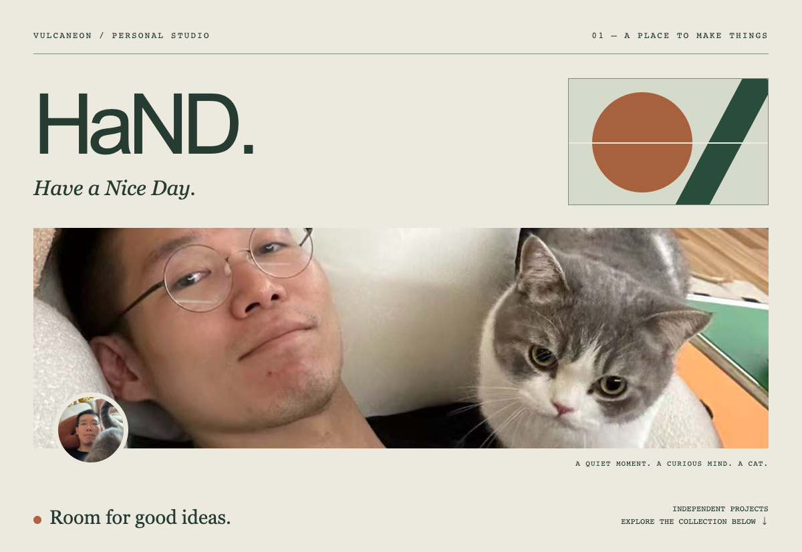

<a href="https://vulcaneon.github.io/">Independent works ↗</a> &nbsp; / &nbsp; <a href="https://github.com/VulcanEon?tab=repositories">Code & repositories ↗</a>

## The project collection

Eight projects, each with its own front door. Take a look around.

<table>
<tr><td width="50%">01 / THE STUDIO<h3><a href="https://mestudio.ai/">MeStudio.AI ↗</a></h3><a href="https://mestudio.ai/">mestudio.ai</a>  </td><td width="50%">02 / THE ARENA<h3><a href="https://fightclub.live/">FightClub.Live ↗</a></h3><a href="https://fightclub.live/">fightclub.live</a>  </td></tr>
<tr><td width="50%">03 / THE QUESTION<h3><a href="https://whorules.today/">WhoRules.Today ↗</a></h3><a href="https://whorules.today/">whorules.today</a>  </td><td width="50%">04 / THE IMAGE LAB<h3><a href="https://gptimage25.ai/">GPTImage25.AI ↗</a></h3><a href="https://gptimage25.ai/">gptimage25.ai</a>  </td></tr>
<tr><td width="50%">05 / THE MOTION ROOM<h3><a href="https://h3max.io/">H3Max.io ↗</a></h3><a href="https://h3max.io/">h3max.io</a>  </td><td width="50%">06 / THE CANVAS<h3><a href="https://image2.to/">image2.to ↗</a></h3><a href="https://image2.to/">image2.to</a>  </td></tr>
<tr><td width="50%">07 / THE PERSPECTIVE<h3><a href="https://howtopose.ai/">HowToPose.AI ↗</a></h3><a href="https://howtopose.ai/">howtopose.ai</a>  </td><td width="50%">08 / THE NEXT CHAPTER<h3><a href="https://oner.app/">Oner.App ↗</a></h3><a href="https://oner.app/">oner.app</a>  </td></tr>
</table>

---

HaND. / VulcanEon · Have a Nice Day.

