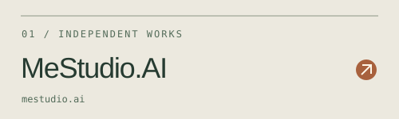
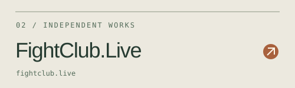
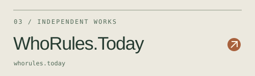
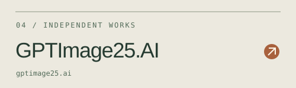
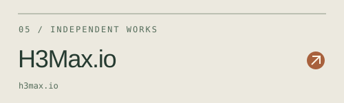
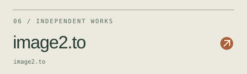
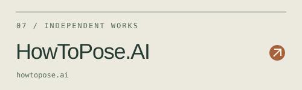
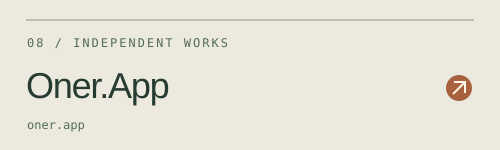

<a href="https://vulcaneon.github.io/">Independent works ↗</a> &nbsp; / &nbsp; <a href="https://github.com/VulcanEon?tab=repositories">Code & repositories ↗</a>

## The project collection

Eight projects, each with its own front door. Take a look around.

<table>
<tr><td width="50%"> <a href="https://mestudio.ai/">MeStudio.AI</a></td><td width="50%"> <a href="https://fightclub.live/">FightClub.Live</a></td></tr>
<tr><td width="50%"> <a href="https://whorules.today/">WhoRules.Today</a></td><td width="50%"> <a href="https://gptimage25.ai/">GPTImage25.AI</a></td></tr>
<tr><td width="50%"> <a href="https://h3max.io/">H3Max.io</a></td><td width="50%"> <a href="https://image2.to/">image2.to</a></td></tr>
<tr><td width="50%"> <a href="https://howtopose.ai/">HowToPose.AI</a></td><td width="50%"> <a href="https://oner.app/">Oner.App</a></td></tr>
</table>

---

HaND. / VulcanEon · Have a Nice Day.

